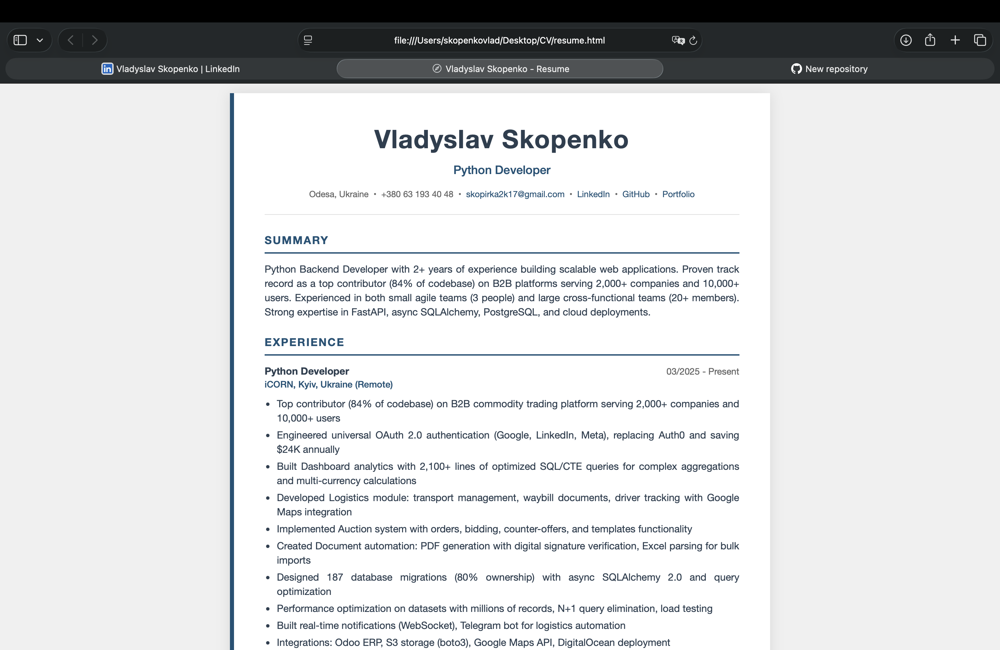

# 📄 Resume Generator

A simple Python script to generate beautiful, professional resumes in HTML format. Easy to customize and export to PDF.


## 📸 Preview



## ✨ Features

- 🎨 Clean, minimalist design with customizable colors
- 📱 A4 paper size, print-ready
- 🔗 Clickable links (email, LinkedIn, GitHub, etc.)
- 📝 Multiple sections: Summary, Experience, Education, Skills, Languages, Certifications, Projects
- 🖨️ Easy PDF export via browser print function
- ⚡ No dependencies required (pure Python)

## 🚀 Quick Start

### 1. Clone or download the repository

```bash
git clone https://github.com/VladSkopenko/resume-generator.git
cd resume-generator
```

### 2. Edit your data

Open `resume_generator.py` and fill in your information in the `RESUME_DATA` dictionary:

```python
RESUME_DATA = {
    "name": "Your Name",
    "title": "Your Job Title",
    
    "contact": {
        "location": "City, Country",
        "phone": "+1 234 567 8900",
        "email": "your.email@example.com",
        "linkedin": "https://linkedin.com/in/yourprofile",
        "github": "https://github.com/yourusername",
        "website": "",  # leave empty if not needed
    },
    
    "summary": """
        Your professional summary here. 2-4 sentences about your 
        experience, skills, and what you're looking for.
    """,
    
    "experience": [
        {
            "position": "Job Title",
            "company": "Company Name",
            "location": "City, Country",
            "period": "01/2022 - Present",
            "achievements": [
                "Achievement 1 with metrics and results",
                "Achievement 2 showing your impact",
                "Achievement 3 with specific technologies used",
            ]
        },
        # Add more positions...
    ],
    
    "education": [
        {
            "degree": "Degree, Major",
            "school": "University Name",
            "period": "2018 - 2022",
            "details": "",  # GPA, honors, etc. (optional)
        },
    ],
    
    "skills": [
        "Python", "JavaScript", "React", "SQL", "Docker", "Git",
        # Add your skills...
    ],
    
    "languages": [
        {"language": "English", "level": "Native"},
        {"language": "Spanish", "level": "B2 (Upper-Intermediate)"},
    ],
    
    "certifications": [
        "AWS Certified Solutions Architect, 2023",
        # Add your certifications...
    ],
    
    "projects": [
        # Optional - add personal projects
        # {
        #     "name": "Project Name",
        #     "description": "Brief description",
        #     "link": "https://github.com/..."
        # },
    ],
}
```

### 3. Generate your resume

```bash
python resume_generator.py
```

The script will:
- Generate `resume.html` in the same directory
- Automatically open it in your default browser

### 4. Export to PDF

1. In your browser, press `Ctrl+P` (Windows/Linux) or `Cmd+P` (Mac)
2. Select **"Save as PDF"** as the destination
3. Click **Save**

## 🎨 Customization

### Change Colors

Edit the `STYLE_CONFIG` dictionary to customize the appearance:

```python
STYLE_CONFIG = {
    "accent_color": "#1a5276",      # Sidebar and headings color
    "text_color": "#2c3e50",        # Main text color
    "light_text": "#666666",        # Secondary text color
    "background": "#ffffff",        # Background color
    "sidebar_width": "6px",         # Left sidebar width
    "font_family": "'Segoe UI', 'Roboto', Arial, sans-serif",
}
```

### Popular Color Schemes

**Classic Blue (default)**
```python
"accent_color": "#1a5276"
```

**Modern Teal**
```python
"accent_color": "#008080"
```

**Professional Green**
```python
"accent_color": "#2e7d32"
```

**Elegant Purple**
```python
"accent_color": "#5e35b1"
```

**Bold Red**
```python
"accent_color": "#c62828"
```

## 📁 Project Structure

```
resume-generator/
├── resume_generator.py    # Main script with your data
├── resume.html           # Generated resume (after running script)
└── README.md             # This file
```

## 🤝 Contributing

Feel free to fork this project and customize it for your needs!

## 📝 License

MIT License - feel free to use this for your own resume!

---

Made with ❤️ by [Vladyslav Skopenko](https://github.com/VladSkopenko)

